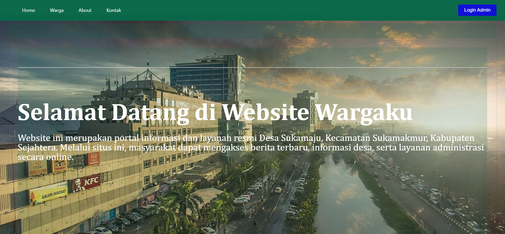
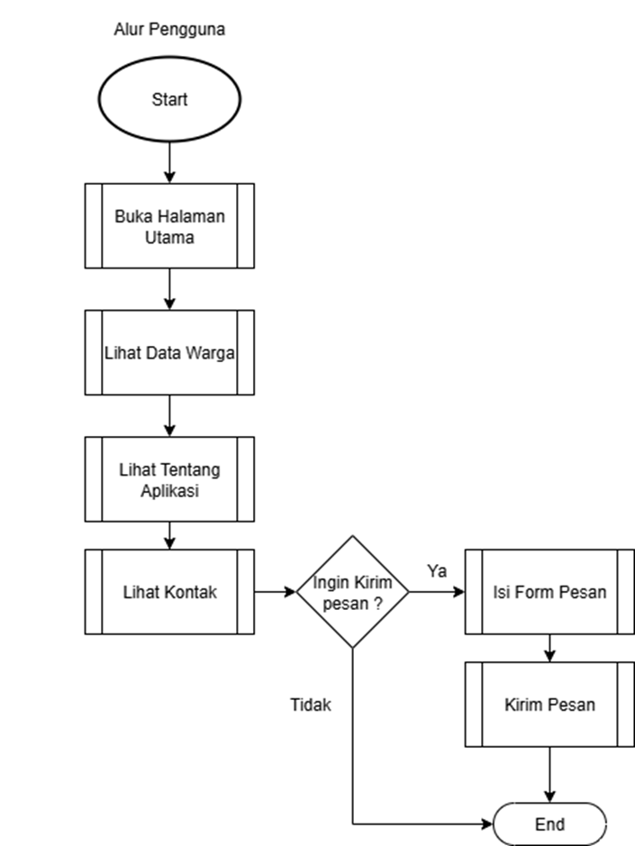
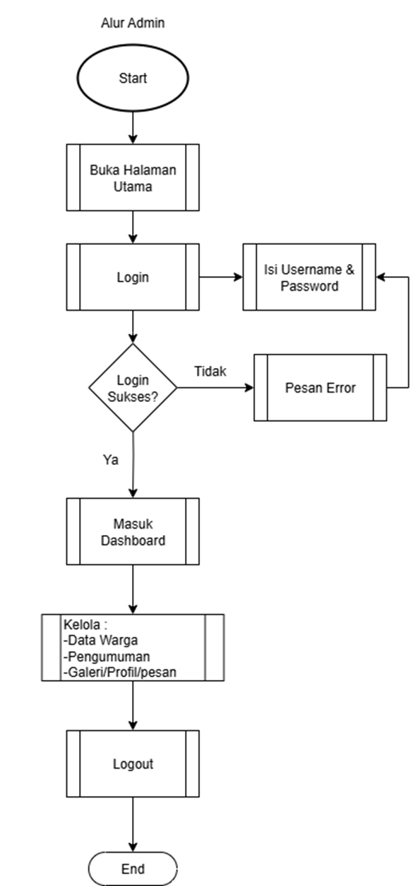

# Website Wargaku

Website “Wargaku” dibuat untuk memfasilitasi digitalisasi pelayanan dan informasi warga di lingkungan RT 15 RW 20 Desa Sukamaju. Selama ini, data warga dan pengumuman RT hanya disampaikan melalui media sosial atau lisan. Ini menyebabkan keterbatasan akses informasi dan kurang tertibnya dokumentasi administrasi.

### Terdapat dua jenis pengguna:

• Warga (Publik): dapat mengakses informasi, pengumuman, dan kontak.
• Admin (Pengurus RT): dapat login, mengelola data warga, menambahkan pengumuman, dan mengatur konten

### Berikut merupakan alur penggunaan aplikasi oleh pengunjung (warga), mulai dari mengakses halaman utama, melihat data, hingga memilih untuk mengirim pesan:

- User
  • Pengunjung membuka halaman utama
  • Melihat data warga, informasi tentang aplikasi, dan kontak
  • Jika ingin menghubungi RT, pengguna dapat mengirim pesan lewat form kontak
  • Jika tidak, proses selesai

- Admin
  Flowchart berikut menggambarkan alur interaksi pengguna dengan peran Admin, mulai dari login hingga melakukan pengelolaan data.
  • Admin membuka halaman utama dan login
  • Jika login berhasil, masuk dashboard
  • Di dalam dashboard, admin dapat mengelola data warga, pengumuman, dan galeri/profil/pesan
  • Setelah selesai, admin logout

## User Experience

https://www.figma.com/proto/1qLUigSPo5Vr3doOzcVscM/Website-Wargaku?node-id=1-2&p=f&t=6gUQ0i7s2RzFSZ0r-0&scaling=scale-down&content-scaling=fixed&page-id=0%3A1&starting-point-node-id=1%3A2

# Development

### Teknologi Front End

Dalam pengembangan sisi tampilan (Front-End) website Wargaku, kami menggunakan teknologi dasar berbasis HTML5, CSS3, dan framework CodeIgniter 4 untuk mempercepat proses styling dan layouting yang responsif

### Teknologi Back End

Sisi back-end dikembangkan sepenuhnya menggunakan CodeIgniter 4, framework PHP modern yang mendukung arsitektur MVC (Model-View-Controller). Beberapa konfigurasi penting yang digunakan meliputi:
• Routing disetting melalui app/Config/Routes.php
• Model seperti WargaModel, PengumumanModel, dan KontakModel menangani operasi ke database MySQL.
• Controller seperti Dashboard.php, Warga.php, Pengumuman.php, dan Kontak.php mengatur logika aplikasi.
